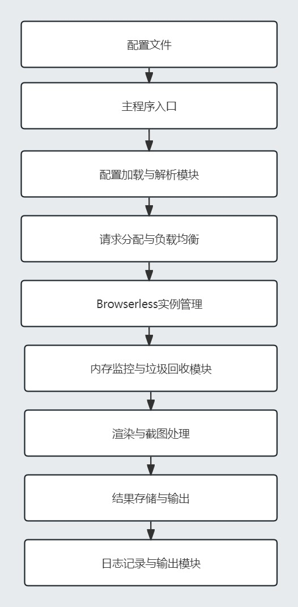

# JS分布式渲染工具


## 本项目旨在提供一个高效的分布式渲染工具，能够均衡负载，防止内存溢出，并且具有良好的可读性、可维护性和可扩展性。通过配置文件的方式，用户可以轻松定制化设置，并且日志输出也支持定制化路径。

- 可控制并发协程数
- 支持多采集任务并发执行
- 可配置browserless服务器地址
- 可为每个browserless服务器配置线程池数量
- 可为每个browserless配置内存大小
- 可设置日志文件的输出地址以及日志文件的名称
- 可配置是否截图

## 程序流程图

## 效果图


## 特色功能
### 1. 分布式渲染
项目支持多个 Browserless 实例的分布式渲染。通过配置文件中的 BrowserlessURLs 列表，可以指定多个 Browserless 实例，工具会自动将请求均匀地分配到不同的实例上，确保负载均衡。这大大提升了渲染效率，避免了单点过载的情况。

### 2. 内存监控与垃圾回收
每个 Browserless 实例都配置了内存监控功能，通过配置文件中的 MemoryLimits 列表，可以为每个实例设置内存阈值。当内存使用超过阈值时，会主动触发垃圾回收，以防止内存溢出（OOM）。这种机制确保了系统在高负载下的稳定性和可靠性。

### 3. 可配置线程池
项目支持为每个 Browserless 实例配置线程池大小，通过配置文件中的 ThreadPools 列表，可以为每个实例设置最大并发处理的请求数，确保系统资源合理使用。这样可以根据实际需求灵活调整，避免资源浪费和过载。

### 4. 可配置日志输出
所有的日志信息都可以保存到文件中，并且可以通过配置文件中的 LogFilePath 参数来设置日志文件的输出路径，方便用户查看和分析日志。日志记录包括了详细的操作和错误信息，便于故障排查和性能调优。

### 5. 配置文件驱动
项目的所有主要配置都集中在一个配置文件中，便于管理和修改。包括 Browserless 实例地址、线程池大小、内存阈值、日志文件路径和截图设置等，均可以在配置文件中进行定制。用户只需简单修改配置文件即可实现各种功能调整，大大提升了操作的便利性。

### 6. 可扩展的代码结构
项目按照功能模块划分了不同的文件夹，提升了代码的可读性、可维护性和可扩展性。主要模块包括配置加载、内存监控和扫描处理等。这样的设计使得代码逻辑清晰，功能模块独立，便于扩展和维护。

## 使用方法
### 1. 克隆项目
bash
复制代码
git clone <repository-url>
cd <project-directory>
### 2. 配置文件
在项目根目录下创建 config.json 文件，按照以下格式进行配置：
```json
{
    "browserlessURLs": [
      "ws://localhost:3000",//browserless服务器1地址
      "ws://localhost:3001",//browserless服务器2地址
      "ws://localhost:3002" //browserless服务器3地址
    ],
    "threadPools": [
        5,  // browserless服务器1的线程池大小
        10, // browserless服务器2的线程池大小
        15  // browserless服务器3的线程池大小
     ],
    "memoryLimits": [
        500000000, // browserless服务器1的内存阈值（字节）
        1000000000, // browserless服务器2的内存阈值（字节）
        1500000000 // browserless服务器3的内存阈值（字节）
      ],  
    "logFilePath": "scan.log",//日志文件地址
    "screenshot": true  //是否截屏
  }
```
### 3. 运行项目
使用以下命令运行项目：

bash
复制代码
go run main.go -config=config.json -file=urls.txt
参数说明：

-config：指定配置文件路径
-file：指定包含待渲染 URL 列表的文件路径
### 4. 查看日志
日志文件会输出到配置文件中指定的路径，用户可以通过查看日志文件来分析系统运行状况。

## 贡献
如果您发现任何问题或有改进建议，请随时提交问题或拉取请求。

## 作者
sunhanfei

